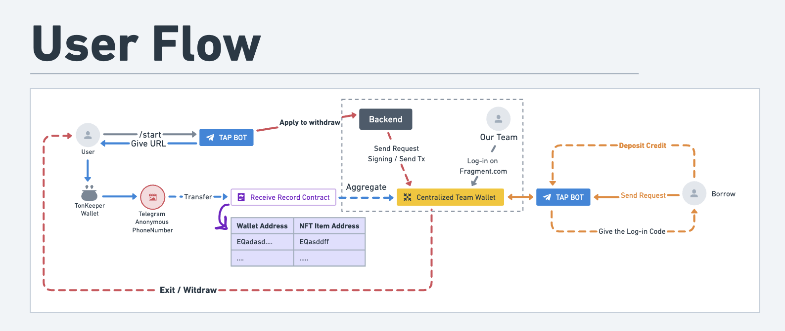
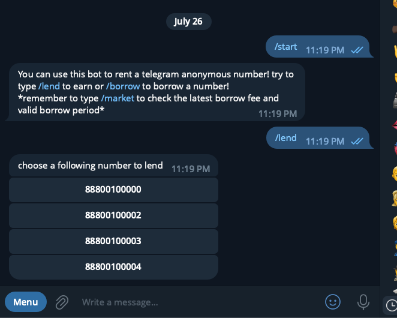
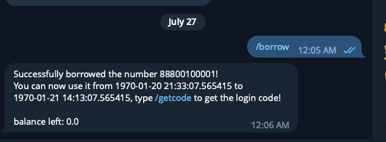
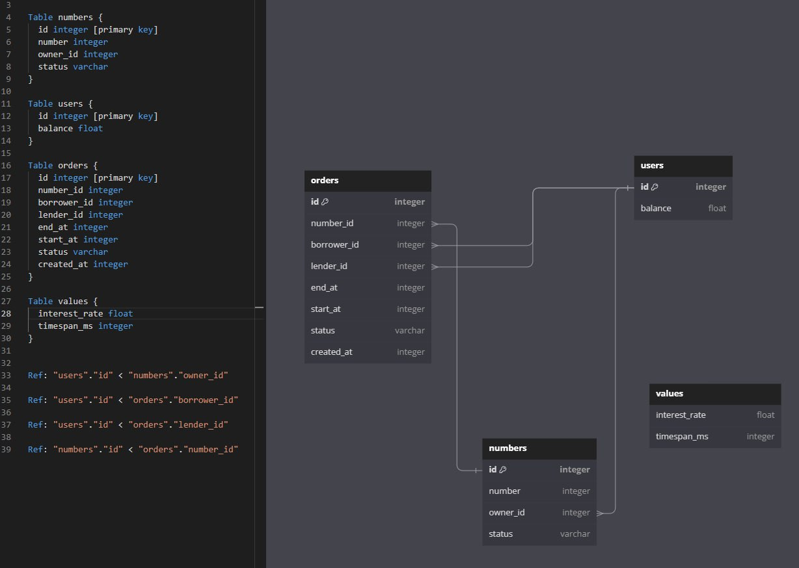

# TAP Lending Protocol V1

```bash
yarn build # To build contract
yarn deploy # To deploy contract
```

Remember to go to `depoly.ts` to change the parameters you want!

---

This repo is for [Hack-a-ton](https://www.defi-hackaton.com/) usage. Still in testing and need for auditing if you want to use in production.

# Intro

TAP Lending is a protocol that assists users in lending/borrowing Telegram Anonymous Phone numbers without worrying about over-collateralization. It enhances capital efficiency and enables users with spot exposure to earn interest while holding NFTs.

Unlike fully on-chain methods, we employ a centralized approach to manage the NFTs due to several reasons:

1. It's safer and lowers the risk of smart contract vulnerabilities.
2. It's more efficient for lending & borrowing, and offers a better interest rate.
3. It alleviates concerns about borrowers not returning the NFT if its value continues to increase.

# Project Structure



_In the following content, we will refer to Telegram Anonymous Phone as TAP._

## For Lender

1. User interacts with the bot at [TAP Lending Bot](https://t.me/tap_lending_bot)
2. The bot then returns the commands and an introductory message detailing the supported commands.
3. (Optional) Once the user inputs the wallet address associated with their TAP, the bot will return the NFTs that the user can transfer to the deposit address.
4. When the user selects the TAP they have in their wallet, the bot will provide an NFT Transfer URL, such as `https://tonkeeper.com/transfer/xxxxxx(nft-item-address)`.
5. Upon receiving the NFT, the bot will display a notification indicating that the TAP Lending team's wallet has received the NFT.

> The NFTs that users deposit will be stored in a centralized wallet managed by the TAP Lending team.



## For Borrower

1. Users who want to borrow TAP should interact with the bot at [TAP Lending Bot](https://t.me/tap_lending_bot).
2. Check the balance of the user's deposit credit. If it equals zero, the bot will provide a deposit address.
3. After the user deposits the funds, we will employ a first-in-first-out (FIFO) method to provide the borrower with a TAP number to lend out.
4. Once the user receives the TAP Phone Number, we will also provide the Log-in Code through the bot at a later time.



## For Project Team (us)

1. We will manage the backend that generates the log-in code, which will be provided to users through our service.
2. Users can review their NFT deposit history via this smart contract.
3. [WIP] Users can request to withdraw their TAP NFT back to their wallet at any time.
4. [WIP] We will approve this process and then execute the transaction.

### The backend diagram:



# Demo

[WIP]

# Questions?

more question, can ask me on [https://t.me/TAP_Lending1](https://t.me/TAP_Lending)
